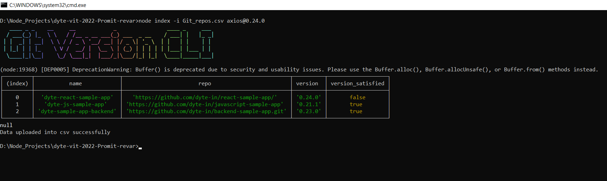

[](https://classroom.github.com/online_ide?assignment_repo_id=7947975&assignment_repo_type=AssignmentRepo)
<div id="top"></div>
<!--
*** Thanks for checking out the Best-README-Template. If you have a suggestion
*** that would make this better, please fork the repo and create a pull request
*** or simply open an issue with the tag "enhancement".
*** Don't forget to give the project a star!
*** Thanks again! Now go create something AMAZING! :D
-->


<!-- PROJECT SHIELDS -->
<!--
*** I'm using markdown "reference style" links for readability.
*** Reference links are enclosed in brackets [ ] instead of parentheses ( ).
*** See the bottom of this document for the declaration of the reference variables
*** for contributors-url, forks-url, etc. This is an optional, concise syntax you may use.
*** https://www.markdownguide.org/basic-syntax/#reference-style-links
-->


<!-- PROJECT LOGO -->
<br />
<div align="center">
  <a href="https://github.com/github_username/repo_name">
    
  </a>

<h3 align="center">GIT CLI TOOL</h3>

  <p align="center">
    project_description
    <br />
    <a href="#Working"><strong>Explore the docs »</strong></a>
    <br />
    <br />
    <a href="#">View Demo</a>
    ·
    <a href="#">Report Bug</a>
    ·
    <a href="#">Request Feature</a>
  </p>
</div>


<!-- TABLE OF CONTENTS -->
<details>
  <summary>Table of Contents</summary>
  <ol>
    <li>
      <a href="#about-the-project">About The Project</a>
      <ul>
        <li><a href="#built-with">Built With</a></li>
      </ul>
    </li>
    <li>
      <a href="#getting-started">Getting Started</a>
      <ul>
        <li><a href="#prerequisites">Prerequisites</a></li>
        <li><a href="#installation">Installation</a></li>
      </ul>
    </li>
    <li><a href="#usage">Usage</a></li>
    <li><a href="#roadmap">Roadmap</a></li>
    <li><a href="#contributing">Contributing</a></li>
    <li><a href="#license">License</a></li>
    <li><a href="#contact">Contact</a></li>
    <li><a href="#acknowledgments">Acknowledgments</a></li>
  </ol>
</details>


<!-- ABOUT THE PROJECT -->
## About The Project



Here's a blank template to get started: To avoid retyping too much info. Do a search and replace with your text editor for the following: `github_username`, `repo_name`, `twitter_handle`, `linkedin_username`, `email_client`, `email`, `project_title`, `project_description`

<p align="right">(<a href="#top">back to top</a>)</p>


### Built With

* [Node.js](https://nodejs.org/)


<p align="right">(<a href="#top">back to top</a>)</p>


<!-- GETTING STARTED -->
## Getting Started

This is an example of how you may give instructions on setting up your project locally.
To get a local copy up and running follow these simple example steps.

### Prerequisites

This is an example of how to list things you need to use the software and how to install them.
* npm
  ```sh
  npm install npm@latest -g
  ```

### Installation

1. Get a free API Key at [https://github.com](https://github.com)
2. Clone the repo
   ```sh
   git clone https://github.com/dyte-submissions/dyte-vit-2022-Promit-revar.git
   ```
3. Install NPM packages
   ```sh
   npm install
   ```
4. Enter your Github API token in `.env`
  
### Working
- For checking wether the version satisfies the noted version or not.
```
node index -i <path to csv> <name@version>
```
This would give you the output in form of table consisting of Name,repo,version,vesrion_satified which will indicate name of the owner, repo url, version of the specified dependency in package.json file and wether the version is lesser or more than the specified version respectively.

- For posting a pull request where version_satisfied is false
```
node index --update -i <path to csv> <name@version>
```
This would change the content of package.json file via api endpoint and will result make a pullrequest to the owner of the repository using API endpoint and add the pullrequest url to the csv respectively.

Code snippet:
- request for version check
```
exports.getVersion=async function(url){
    return await axios.get(url, {headers:{
        Authorization: 'Bearer ' + process.env.PERSONAL_ACCESS_TOKEN
      }})
        .then(res => {
            
            let buff = new Buffer(res.data.content, 'base64');
            let text = buff.toString('ascii');
            
            var content=JSON.parse(text);
            content['sha']=res.data.sha;
            
            
            
            return content;
        })
        
        .catch(error => {
    console.log(error.data);
    
  });         
}
```
- to change and make pull request

```
exports.CreatePullRequest=async function(url,data){
    //console.log(data);
    fs.readFile(`./Files/${data.repo}.txt`, async (err, contain) => {
        //console.log(contain);
        var sha=JSON.parse(contain)['sha'];
        const octokit = new Octokit({
            auth:process.env.PERSONAL_ACCESS_TOKEN
          })
    const response=await octokit.request(
        'PUT /repos/{owner}/{repo}/contents/{path}',
        {
        owner: data.owner,
        repo: data.repo,
        path: 'README.md',
        message: "changed the package.json",
        content: Buffer.from(contain, "ascii").toString("base64"),
        sha:sha
         },
        )
         .catch(err=>console.log(err));
         console.log(response);
      })
      
    

const response2 = await octokit.request(
    `POST /repos/{owner}/{repo}/pulls`, {  
        owner: data.owner,
        repo: data.repo,
        title: data.title,
        body: data.body,
        head: master, 
        base: master }
).then(res=>console.log(res))
.catch(error=>console.log(error.response.data));
return response2;
}
```
<p align="right">(<a href="#top">back to top</a>)</p>


<!-- USAGE EXAMPLES -->
## Usage
All the opensource modules are used whose information can be seen in `package.json` file.

<p align="right">(<a href="#top">back to top</a>)</p>


See the [open issues](https://github.com/github_username/repo_name/issues) for a full list of proposed features (and known issues).

<p align="right">(<a href="#top">back to top</a>)</p>


<!-- CONTRIBUTING -->
## Contributing

Contributions are what make the open source community such an amazing place to learn, inspire, and create. Any contributions you make are **greatly appreciated**.

If you have a suggestion that would make this better, please fork the repo and create a pull request. You can also simply open an issue with the tag "enhancement".
Don't forget to give the project a star! Thanks again!

1. Fork the Project
2. Create your Feature Branch (`git checkout -b feature/AmazingFeature`)
3. Commit your Changes (`git commit -m 'Add some AmazingFeature'`)
4. Push to the Branch (`git push origin feature/AmazingFeature`)
5. Open a Pull Request

<p align="right">(<a href="#top">back to top</a>)</p>


<!-- LICENSE -->
## License

Distributed under the MIT License. See `LICENSE.txt` for more information.

<p align="right">(<a href="#top">back to top</a>)</p>


<!-- CONTACT -->
## Contact
Email ID: [promit.revar2211@gmail.com](promit.revar2211@gmail.com)
Linkedin : [promit-revar](https://www.linkedin.com/in/promit-revar-5b87381a3/)
Project Link: [dyte-submissions/dyte-vit-2022-Promit-revar](https://github.com/dyte-submissions/dyte-vit-2022-Promit-revar.git)

<p align="right">(<a href="#top">back to top</a>)</p>


<p align="right">(<a href="#top">back to top</a>)</p>


